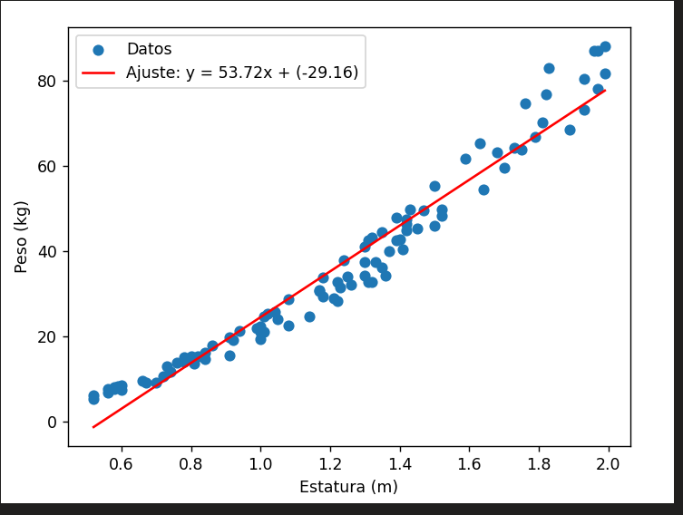

<h1 align="center" id="title">Calculo del peso 🤖</h1>

<p id="description">Practico 1: En este trabajo practico, el código genera 100 pares de estatura y peso usando un IMC aleatorio dentro de un rango saludable. Luego, ajusta una línea recta a estos datos utilizando una función lineal. Finalmente, se grafican los datos junto con la línea ajustada para visualizar cómo se distribuyen los puntos y cómo se ajusta la función a ellos.
El código es claro y está bien estructurado, y el uso de curve_fit facilita el ajuste de la función lineal a los datos generados.</p>

<h2>Capturas de pantalla:</h2>



<h2>🛠️ Pasos para instalacion y ejecucion:</h2>

<p>1. Clonar el proyecto</p>

```
git clone https://github.com/cesarvargasL/practico1-SIS402.git 
```

<p>2. Instalar <strong>python 3.12</strong> en caso de no contar con ello desde <strong>https://www.python.org/downloads/</strong></p>

<p>3. Instalar librerias</p>

```
pip install matplotlib
```
```
pip install scipy
```

<p>4. Ejecutar</p>

```
python practico01.py
```


<h2>💻 Hecho con:</h2>

Tecnoloias y lenguajes usados en el proyecto:

* Python 3.12
* matplotlib
* scipy


<h2>🛡️ Desarrolado:</h2>

Este trabajo esta desarrollado por el estudiante César Luis Vargas Lezano 
